

  

**Student:** Jennifer Elie  
**Course:** CPS 593 Cybersecurity  
**Due:** March 2nd 2026  
---
**School:** SUNY New Paltz  
**Professor:** Kaitlin Hoffmann  
**Semester:** Spring 2026  
---

## Table of Contents
- [General System Tasks](#1-open-the-terminal-in-your-virtual-machine-vm-enter-the-command-to-retrieve-available-updates)
  - [1. Update system](#1-open-the-terminal-in-your-virtual-machine-vm-enter-the-command-to-retrieve-available-updates)
  - [2. Upgrade system](#2-upgrade-your-system)
  - [3. Reboot system](#3-reboot-your-system)
- [User Tasks](#4-change-the-current-user-to-root-using-the-command-sudo-su-root-what-does-the-prompt-look-like)
  - [4. Switch to root user](#4-change-the-current-user-to-root-using-the-command-sudo-su-root-what-does-the-prompt-look-like)
  - [5. Create users (useradd vs adduser)](#5-while-logged-in-as-root-create-a-new-user-with-the-name-bobby-using-the-command-useradd-next-create-another-user-with-the-name-sally-using-the-command-adduser-what-is-the-difference-between-the-two)
  - [6. Switch to sally](#6-change-the-current-user-to-sally-what-does-the-prompt-look-like-now)
  - [7. Test limited permissions](#7-while-still-logged-in-as-sally-try-to-create-a-new-user-with-the-name-earl-what-happens-why-what-could-you-do-to-allow-her-to-create-a-new-user)
  - [8. Delete user bobby](#8-enter-exit-until-you-are-logged-into-your-own-account-again-delete-the-user-bobby)
  - [9. Change sally's password](#9-change-the-password-of-sally-to-something-you-can-remember-using-sudo-passwd-sally)
  - [10. Root security risks](#10-even-though-its-easier-to-complete-taskscommands-why-is-it-bad-practice-to-stay-logged-in-as-root)
  - [11. Check user ID](#11-enter-the-command-to-see-what-your-user-id-is)
- [Group Tasks](#12-what-groups-does-the-user-jelie-belong-to)
  - [12. View user groups](#12-what-groups-does-the-user-jelie-belong-to)
  - [13. Grant sally sudo access](#13-give-sally-the-ability-to-execute-sudo-commands-next-try-to-create-a-new-user-while-logged-in-as-sally)
  - [14. Create cybersec group](#14-log-out-of-sally-and-back-into-your-own-account-create-a-new-group-called-cybersec)
  - [15. Add sally to cybersec](#15-add-sally-to-the-group-cybersec)
  - [16. Check sally's groups](#16-check-to-see-which-groups-sally-belongs-to)
- [Permission and ACL Tasks](#17-create-a-new-directory-called-lab1-enter-the-command-to-find-the-permissions-of-the-directory-who-is-the-owner-and-group-owner-of-this-directory-what-permissions-does-the-owner-group-and-other-have)
  - [17. Directory permissions](#17-create-a-new-directory-called-lab1-enter-the-command-to-find-the-permissions-of-the-directory-who-is-the-owner-and-group-owner-of-this-directory-what-permissions-does-the-owner-group-and-other-have)
  - [18. Create executable script](#18-change-your-directory-to-lab1-create-a-new-bash-file-called-helloworld-when-ran-your-program-should-just-print-hello-world-dont-forget-to-make-your-bash-file-executable)
  - [19. Modify file permissions](#19-enter-the-command-ls--l-helloworld-what-are-the-reading-writing-and-executing-permissions-for-the-owner-group-and-other-change-the-permissions-so-the-group-also-has-w-and-x-permissions)
  - [20. View ACL](#20-use-the-getfacl-command-to-view-the-acl-of-the-file)
  - [21. Set ACL permissions](#21-using-the-setfacl-command-allow-the-user-sally-the-ability-to-read-and-write-to-the-file)

---
  

---

<!-- General System Tasks --> 
<!-- anchor: General-System-Tasks -->

  

## 1. Open the terminal in your Virtual Machine (VM). Enter the command to retrieve available updates.
**Command:** `sudo apt update`  
**Command explanation:**  
- **`sudo:`** Is short for superuser do. It is required for users who are not logged in as root to execute commands that require administrative privileges. It is best practice to use sudo instead of logging in as the root user for several reasons, including maintaining logs of users executing privileged commands, discouraging unauthorized access, and improving system security. It is also recommended to disable root login because root has full control over the system and is a prime target for attackers.  
- **`apt:`** Stands for Advanced Package Tool. It is a package manager used in some Linux distributions. It allows you to update (check for available updates), install (add new packages), upgrade (update already installed packages when used alongside the update command), and remove (uninstall specified packages).  
- **`update:`** As part of the apt command, instructs the system to check the repositories for any changes or updates to packages already installed on the system.  

**Command line output:**  
As shown in the image below, 84 packages can be upgraded to newer versions on my system. 

  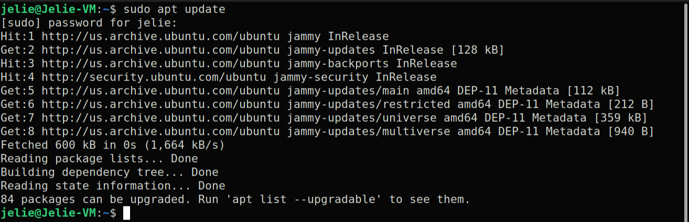

## 2. Upgrade your system.
**Command:** `sudo apt upgrade`  
**Command explanation:**  
- **`sudo:`** Same as before. It temporarily grants administrator level permissions in order to execute a command.  
- **`apt:`** The Advanced Packaging Tool is used again because it is needed to upgrade the system packages.  
- **`upgrade:`** This keyword after the apt command checks for any packages that were logged as having changed repositories by the previously run apt update command and installs those logged upgrades.  

**Command line output:**  
A prompt will appear asking whether to proceed with the upgrade. Enter “y” to continue or “n” to stop the upgrade.

  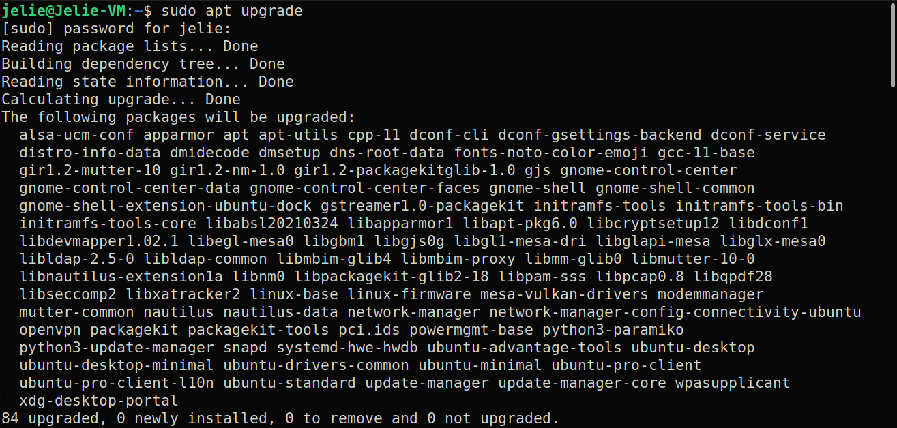

## 3. Reboot your system.
**Command:** `sudo reboot`  
**Command explanation:**  
- **`sudo:`** Temporarily allows administrator-level permissions for command execution. It is required for rebooting the system because not every user should have the ability to restart or temporarily take down the system.    
- **`reboot:`** This is the command used to restart the system.  

**Command line output:**  

  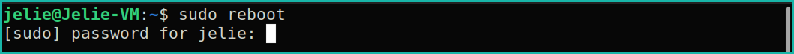

  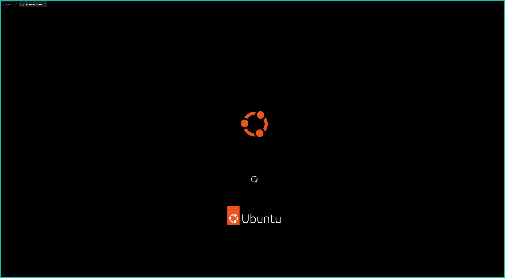

---  

<!-- User-Tasks -->

  

## 4. Change the current user to root using the command sudo su root. What does the prompt look like?  
**Command:** `sudo su root`  
**Command explanation:**  
- **`sudo:`** Temporarily allows administrator level permission for command execution.  
- **`su:`** Stands for substitute user. This command allows switching to and running commands as another user. If no user is specified, the default user is root.  
- **`root:`** The user to switch to after executing the substitute user command. Root is the default user for this command, but explicitly specifying it is not an issue.

**Command line output:**  
As can be seen in the image, the username changes from jelie to root, and the shell changes from bash to shell. This indicates that the system is now signed in as the root user.  

  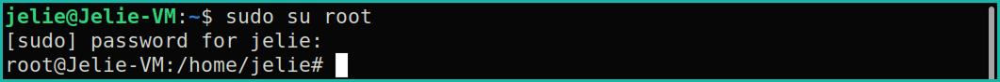

## 5. While logged in as root, create a new user with the name bobby using the command useradd. Next, create another user with the name sally using the command adduser. What is the difference between the two?  
**Command:** `useradd bobby`  
**Command:** `adduser sally`  
**Command explanation:**  
- **`useradd:`** This command is the basic built-in Linux command used to add a new user. It only adds the user to the system and does not automatically create a home directory or prompt for a password during creation.  
- **`bobby:`**  This argument specifies the name of the new user being created with the useradd command.  
- **`adduser:`** This is not a basic command but a Perl script that uses useradd internally. It performs additional steps automatically, such as creating a home directory, setting up a password, and prompting for additional user information (full name, room number, work phone, home phone, and other).  
- **`sally:`** This argument specifies the name of the new user being created with the adduser command.  

**Command line output:**  
As can be seen in the next images, the passwd file contains both users, bobby and sally. However, sally has a home directory while bobby does not. 

  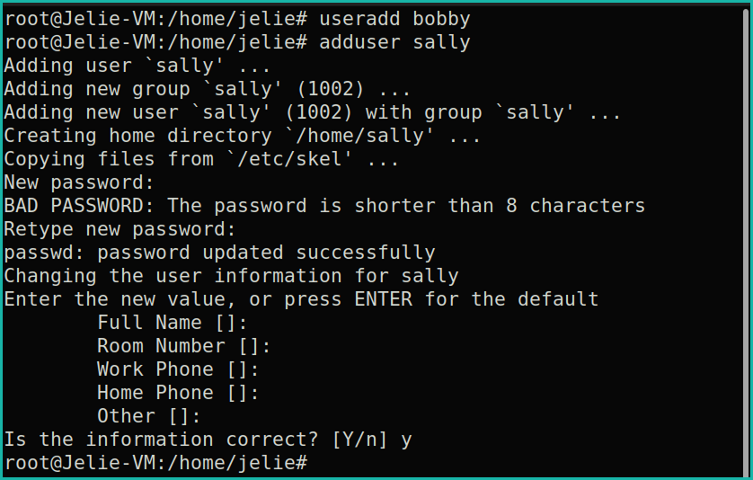

  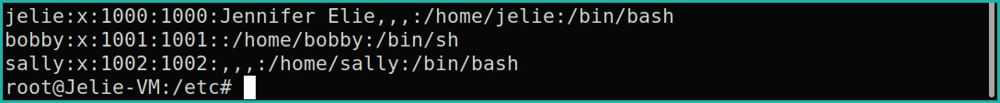

  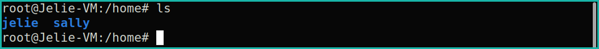

## 6. Change the current user to sally. What does the prompt look like now?  
**Command:** `su sally`    
**Command explanation:**  
- **`su:`** Stands for substitute user. This command allows commands to be run as a specified user.  
- **`sally:`**  The argument passed to the substitute user command. It specifies the user account to switch to. In this case, the session is being switched to the user sally.  

**Command line output:**  
As shown in the image, the username in the command prompt changes from root to sally, indicating that the system is no longer operating under the root account. The shell also changes from shell back to bash. This confirms that the active session is now running under the sally user account rather than the root user.

  

## 7. While still logged in as sally, try to create a new user with the name earl. What happens? Why? What could you do to allow her to create a new user?   
**Command:** `sudo adduser earl`    
**Command explanation:**  
- **`sudo:`** Temporarily allows administrator level permission for command execution.
- **`adduser:`** A Perl script that utilizes the useradd command internally and automatically performs additional steps such as creating a home directory and prompting for additional user details during account creation.  
- **`earl:`** This argument specifies the name of the new user being created with the adduser command.  

**Command line output:**  
As shown in the command line output, the command fails because sally is not a member of the sudo group and therefore does not have permission to execute commands with elevated privileges. To allow sally to execute the adduser command, she would need to be added to the sudo group. Alternatively, a group with limited sudo privileges could be created and sally could be added to that group.

  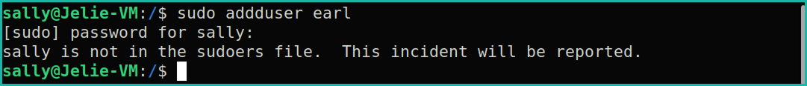

  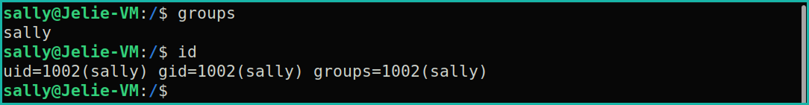

## 8. Enter exit until you are logged into your own account again. Delete the user bobby.    
**Command:** `exit`    
**Command:** `exit`  
**Command:** `sudo userdel bobby`  
**Command explanation:**  
- **`exit:`** This command is used to exit the current shell session. Running it multiple times returns to the previous user session until logged back into the original account.  
- **`sudo:`** Temporarily allows administrator level permission for command execution.  
- **`userdel:`** This command deletes a user account from the system. It does not automatically remove files associated with the user. Additional arguments such as -f can be used to force deletion and -r can be used to remove the user’s home directory. However, since bobby was created using the useradd command and does not have a home directory, there are no associated home directory files to remove.  
- **`bobby:`** This argument specifies the name of the user account to delete using the userdel command.  

**Command line output:**  
When checking the passwd file, it can be seen that bobby has been deleted from the system.

  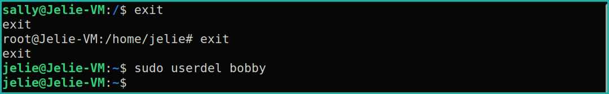

  

## 9. Change the password of sally to something you can remember using sudo passwd sally    
**Command:** `sudo passwd sally`    
**Command explanation:**  
- **`sudo:`** Temporarily allows administrator level permission for command execution.  
- **`passwd:`** Short for password. This command is used to manage user account passwords.  
- **`sally:`** This argument specifies the user account for which the password is being changed.  

**Command line output:**  

  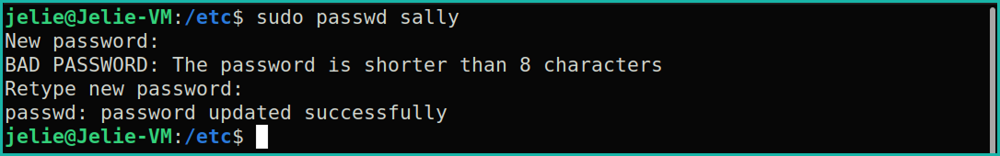

## 10. Even though it’s easier to complete tasks/commands, why is it bad practice to stay logged in as root?     
Some of the reasons were mentioned earlier in the explanation of sudo, but to reiterate, the common reasons to avoid logging in as the root user are:
1.	It allows for logging and tracking of each user’s executed commands when using sudo.
2.	By default, sudo requires a user’s password to execute privileged commands. This helps prevent unauthorized actions and reduces the risk of misuse.
3.	Logging in as the root user grants full system privileges at all times, whereas sudo and group-based privileges can be configured to allow only a restricted set of commands.
4.	Keeping the root account enabled and actively used poses a security risk because it is a prime target for attackers. If root-level access is compromised, the entire system is exposed.

## 11. Enter the command to see what your user id is.      
**Command:** `id`    
**Command explanation:**  
- **`id:`** This command outputs the UID (user identification) and the GID (group identification) information. If no user is specified, the output will reflect the current shell’s user.  

**Command line output:**  

  

---

<!-- Group-Tasks -->

  

## 12. What groups does the user jelie belong to?       
**Command:** `id`    
**Command:** `groups`  
**Command explanation:**  
- **`id:`** This command outputs the UID (user identification) and the GID (group identification) information. If no user is specified, the output will reflect the current shell’s user.  
- **`passwd:`** This command displays the groups that a specified user belongs to. If no user is specified, the output will reflect the current shell’s user.  

**Command line output:**  
The groups that I am a part of are jelie, adm, cdrom, sudo, dip, plugdev, lpadmin, lxd, and sambashare.

  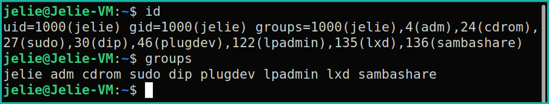

## 13. Give sally the ability to execute sudo commands. Next, try to create a new user while logged in as sally.         
**Command:** `sudo usermod -a -G sudo sally`    
**Command:** `sudo useradd ava` 
**Command explanation:**  
- **`sudo:`** Temporarily allows administrator level permission for command execution.  
- **`usermod:`** This command modifies an existing user account.  
- **`-aG or -a -G:`** The -a flag appends the user to a group, and the -G flag specifies the group. Together, they add the user to the specified group without removing them from other groups.  
- **`sudo:`** This argument specifies the group to append to the user specified by the next argument of the usermod command. This group grants sudo privileges.  
- **`sally:`** This argument specifies the user account being modified.  
- **`useradd:`** This command creates a new user account on the system.  
- **`ava:`** This argument specifies the name of the new user being created.  

**Command line output:**  

  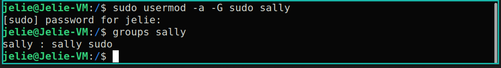

  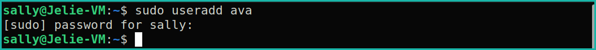

## 14. Log out of Sally and back into your own account. Create a new group called cybersec.      
**Command:** `sudo groupadd cybersec`    
**Command explanation:**  
- **`sudo:`** Temporarily allows administrator level permission for command execution.  
- **`groupadd:`** This command is used to create a new group on the system.  
- **`cybersec:`** This argument specifies the name of the new group being created.  

**Command line output:**  

  

## 15. Add sally to the group, cybersec       
**Command:** `sudo usermod -a -G cybersec sally`    
**Command explanation:**  
- **`sudo:`** Temporarily allows administrator level permission for command execution.  
- **`usermod:`** This command modifies an existing user account.  
- **`-aG or -a -G:`** The -a flag appends the user to a group, and the -G flag specifies the group. Together, they add the user to the specified group without removing them from other groups.  
- **`cybersec:`** This argument specifies the group to append to the user specified by the next argument of the usermod command.
- **`sally:`** This argument specifies the user account being modified.

**Command line output:**  

  

## 16. Check to see which groups sally belongs to.       
**Command:** `id sally`    
**Command:** `groups sally` 
**Command explanation:**  
- **`id:`** This command displays the user ID (UID), group ID (GID), and all groups associated with the specified user.  
- **`sally:`** This argument specifies the user whose identification and group information is being displayed.  
- **`groups:`** This command displays the groups that a specified user belongs to.  
- **`sally:`** This argument specifies the user whose groups are being displayed.  

**Command line output:**  

  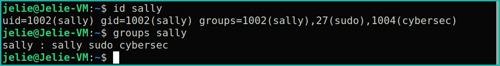

---

<!-- Permission-and-ACL-Tasks -->

  

## 17. Create a new directory called lab1. Enter the command to find the permissions of the directory. Who is the owner and group owner of this directory? What permissions does the owner, group and other have?       
**Command:** `mkdir lab1`  
**Command:** `ls -ld lab1`   
**Command explanation:**  
- **`mkdir:`** Short for make directory. It is used to create folders to organize the file structure of the system.  
- **`lab1:`** This argument specifies the name of the directory being created.
- **`ls:`** Lists the files and directories in the current directory.
- **`-ld or -l -d:`** The -l flag displays detailed information in long format, including the permissions, owner,and group owner. The -d flag tells the command to show information about the directory itself. When used together as -ld, the command shows the detailed information for the specified directory only.
- **`lab1:`** This argument specifies the name of the directory for which you want to view the permissions and detailed information when used with command ls -ld.

**Command line output:**  
The owner is jelie. The group is jelie.  
The permissions are as follows:   
- Owner: rwx
- Group: rwx
- Other: r-x

  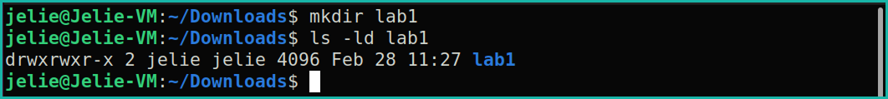

## 18. Change your directory to lab1. Create a new bash file called, helloWorld. When ran, your program should just print “Hello World!”. (Don’t forget to make your bash file executable).       
**Command:** `cd lab1`    
**Command:** `nano helloWorld`    
**Command:** `chmod +x helloWorld`    
**Command explanation:**  
- **`cd:`** Changes the current directory.
- **`lab1:`** The directory being changed into.
- **`nano:`** A text editor used to create and edit files directly in the terminal. In this case, it is used to create and edit the bash script.
- **`helloWorld:`** The name of the bash file being created.
- **`chmod:`** Is short for change mode. This command is used to change or modify the permissions of a file or directory. The permissions are read, write, and execute.  
- **`+x:`** This argument adds executable permissions to the specified file, allowing it to be run as a program.
- **`helloWorld:`** The name of the file being having its permissions modified.

**Command line output:**  

  

**File Input:** 
- **`#!/bin/bash:`** This line tells the system to use bash to run the script. It is also called 
- **`echo “Hello World!”`**This line prints Hello World! to the terminal.

  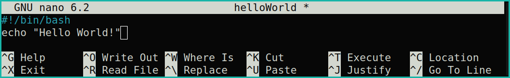

  

  

## 19. Enter the command ls -l helloWorld. What are the reading, writing, and executing permissions for the owner, group and other? Change the permissions so the group also has w and x permissions.      
**Command:** `ls -l helloWorld`    
**Command:** `chmod g+wx helloWorld`  
**Command explanation:**  
- **`ls:`** Lists files and directories with detailed information when used with the -l option.
- **`-L:`** Displays the file in long format showing permissions, owner, group, size, and modification date.
- **`helloWorld:`** This is the file whose permission information will be displayed.
- **`g+wx:`** This argument is used with the chmod command, where g specifies the group, + means to add permissions, and w and x represent write and execute permissions; together, g+wx adds write and execute permissions to the group for the specified file.
- **`helloWorld:`** This argument specifies the file whose permissions are being modified by the chmod command.

**Command line output:**  
For the first ls -l command, the rwx permissions were as follows:  
Owner: read, write, execute  
Group: read, write, execute  
Other: execute  
Because the group already had full permissions, the command chmod g-wx helloWorld was run to adjust the permissions as directed in the lab. After running that command, the permissions were:  
Owner: read, write, execute  
Group: read  
Other: execute  
The group permissions were then set back to rwx to restore the original configuration.  

  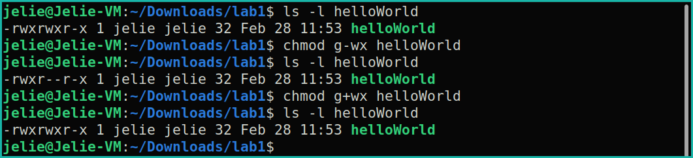

## 20. Use the getfacl command to view the ACL of the file.     
**Command:** `getfacl helloWorld`    
**Command explanation:**  
- **`getfacl:`** This command displays the Access Control List (ACL) permissions of a file or directory. It shows both the standard permissions and any additional ACL entries that have been set.  
- **`helloWorld:`** This argument specifies the file whose ACL information is being displayed.  

**Command line output:**  

  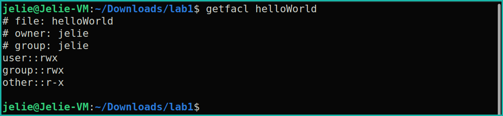

## 21. Using the setfacl command, allow the user, sally, the ability to read and write to the file.     
**Command:** `setfacl -m u:sally:rw- helloWorld`    
**Command explanation:**  
- **`setfacl:`** Modifies the Access Control List (ACL) permissions for a file or directory. It allows for groups and users to be given individualized permissions beyond standard owner/group/other permissions.
- **`-m:`** Stands for modify. It is used to modify or add a new ACL entry to a file.
- **`u::`** Specifies that the permission is being assigned to a specific user. Got a group the flag would be g.
- **`sally::`** The username of the user receiving the specified permissions.
- **`rw-:`** Grants read and write permissions and no execute permissions
- **`helloWorld:`** The file to which the setfacl command is targeting.

**Command line output:**  

  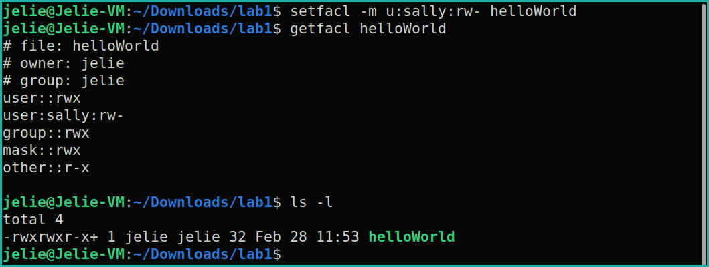

---

  

---

  <a href="../README.md">← Back to Main README</a>

